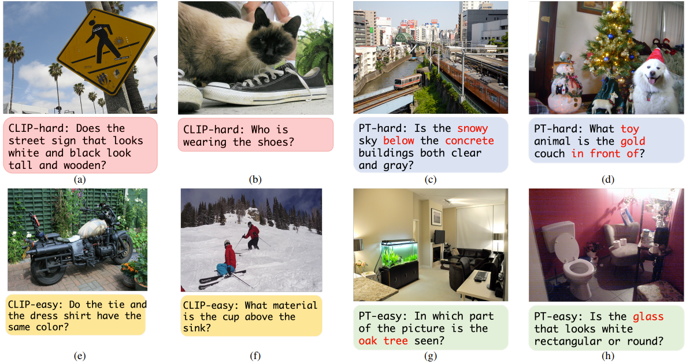

# Description
This is an official repo for ICCV2023 Toward Unsupervised Realistic Visual Question Answering, which encourage the model to answer the answerable questions and reject the un-answerable ones (See figure below). See [Paper](https://arxiv.org/pdf/2303.05068.pdf) for details.



# Clone this repo
```
git clone https://github.com/chihhuiho/RGQA.git
```

# Create environment
Might need to install the different pytorch and torchvision version based on your device.
```
conda env create -f environment.yml
```

# Data Preparation
1. Download butd related data, gqa ([link](https://drive.google.com/file/d/1p5GsYo80blyxM1TYGr0AOIjgo5DFFpbU/view?usp=sharing)) and the proposed RGQA dataset ([link](https://drive.google.com/file/d/1zcbUrxpgviTojMLOj08msJLcBAbculBN/view?usp=sharing)) 
```
cd data
sh download_rgqa.sh
```
2. Follow the data preparation step from [Lxmert repo](https://github.com/airsplay/lxmert) and download the rest of the features. The data folder should looks like
```
|-- data
    |-- butd  
    |-- download_rgqa.sh  
    |-- gqa  
    |-- lxmert  
    |-- mscoco_imgfeat  
    |-- nlvr2  
    |-- nlvr2_imgfeat  
    |-- vg_gqa_imgfeat  
    |-- vqa
```

# Compute Metric
To encourage future research on RVQA, we provide a script to evaluate the proposed dataset using the proposed metric (e.g. AUAF, FF95 and FACC). As long as the model prediction is organized as the provided example, the script can be used to compute the model performance. Below are the steps.
1. Enter the compute_accfpr folder
```
cd compute_accfpr
```
2. The RGQA dataset format is identical to the example.json file and the model prediction should be identical to example_predict.json format.
3. Compute the metric
```
python compute_accfpr.py
```


# Training and evaluating different backbones
Below are the script for 3 backbones, including lxmert, butd and uniter. Simply change the ``BACKBONE" to the desired backbone in the following command. 

## Training 
1. Finetune vanilla GQA with BACKBONE
```
sh scripts/BACKBONE/train/vanilla.sh 0
```

2. Finetune BACKBONE with random pairing Pseudo UQ (RP) on GQA
```
sh scripts/BACKBONE/train/rp.sh 0
```

3. Finetune BACKBONE with hard Pseudo UQ (RP) on GQA
```
sh scripts/BACKBONE/train/rp_with_hard_uq.sh 0
```

4. Finetune BACKBONE with mixup RoI on GQA
```
sh scripts/BACKBONE/train/mix.sh 0
```


## Download pretrained weight
The pretrained weight for different RVQA approahces can be download using the following code (about 8GB).
```
cd snap/gqa
sh download_rgqa_ckpt.sh
```


## Testing with different RVQA approaches 
1. BACKBONE with FRCNN
```
sh scripts/BACKBONE/test/frcnn.sh $GPUID
sh scripts/BACKBONE/test/frcnn.sh 0
```
The result is located in ``snap/gqa/BACKBONE/test/frcnn" and it should be identical to ``snap/gqa/pretrain/BACKBONE/frcnn"

2. BACKBONE with MSP
```
sh scripts/BACKBONE/test/msp.sh $GPUID
sh scripts/BACKBONE/test/msp.sh 0
```
The result is located in ``snap/gqa/BACKBONE/test/msp" and it should be identical to ``snap/gqa/pretrain/BACKBONE/msp"

3. BACKBONE with ODIN
```
sh scripts/BACKBONE/test/odin.sh $GPUID
sh scripts/BACKBONE/test/odin.sh 0
```
The result is located in ``snap/gqa/BACKBONE/test/odin" and it should be identical to ``snap/gqa/pretrain/BACKBONE/odin"

4. BACKBONE with Maha
```
sh scripts/BACKBONE/test/maha.sh $GPUID
sh scripts/BACKBONE/test/maha.sh 0
```
The result is located in ``snap/gqa/BACKBONE/test/maha" and it should be identical to ``snap/gqa/pretrain/BACKBONE/maha"

5. BACKBONE with Energy
```
sh scripts/BACKBONE/test/energy.sh $GPUID
sh scripts/BACKBONE/test/energy.sh 0
```
The result is located in ``snap/gqa/BACKBONE/test/energy" and it should be identical to ``snap/gqa/pretrain/BACKBONE/energy"

6. BACKBONE with Q-C
```
sh scripts/BACKBONE/test/qc.sh $GPUID
sh scripts/BACKBONE/test/qc.sh 0
```
The result is located in ``snap/gqa/BACKBONE/test/qc" and it should be identical to ``snap/gqa/pretrain/BACKBONE/qc"

7. BACKBONE with resample
```
sh scripts/BACKBONE/test/resample.sh $GPUID
sh scripts/BACKBONE/test/resample.sh 0
```
The result is located in ``snap/gqa/BACKBONE/test/resampling" and it should be identical to ``snap/gqa/pretrain/BACKBONE/resampling"


8. BACKBONE with RP with only hardUQ
```
sh scripts/BACKBONE/test/rp_with_harduq.sh $GPUID
sh scripts/BACKBONE/test/rp_with_harduq.sh 0
```
The result is located in ``snap/gqa/BACKBONE/test/RP_with_hard_uq" and it should be identical to ``snap/gqa/pretrain/BACKBONE/RP_with_hard_uq"

9. BACKBONE with RP
```
sh scripts/BACKBONE/test/rp.sh $GPUID
sh scripts/BACKBONE/test/rp.sh 0
```
The result is located in ``snap/gqa/BACKBONE/test/RP" and it should be identical to ``snap/gqa/pretrain/BACKBONE/RP"

10. BACKBONE with Mixup
```
sh scripts/BACKBONE/test/mixup.sh $GPUID
sh scripts/BACKBONE/test/mixup.sh 0
```
The result is located in ``snap/gqa/BACKBONE/test/mixup" and it should be identical to ``snap/gqa/pretrain/BACKBONE/mixup"

11. BACKBONE with Ensemble
```
sh scripts/BACKBONE/test/ensemble.sh $GPUID
sh scripts/BACKBONE/test/ensemble.sh 0
```
The result is located in ``snap/gqa/BACKBONE/test/ensemble" and it should be identical to ``snap/gqa/pretrain/BACKBONE/ensemble"

12. Test all RVQA approaches with BACKBONE
```
sh scripts/BACKBONE/test/test_all.sh $GPUID
sh scripts/BACKBONE/test/test_all.sh 0
```

# Acknowledgement
The repo uses the code and checkpoint from
1. https://github.com/airsplay/lxmert
2. https://github.com/ChenRocks/UNITER


